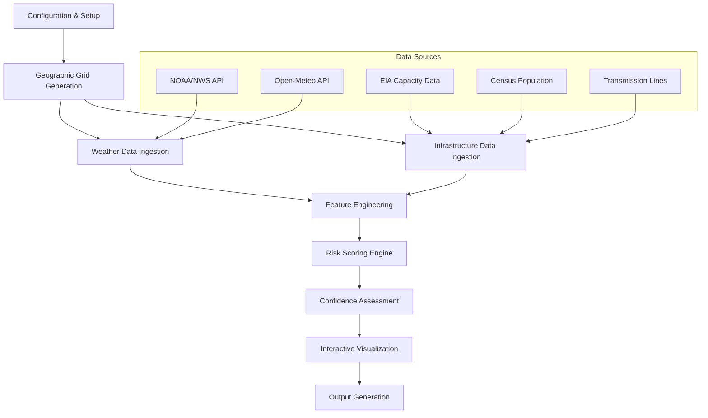
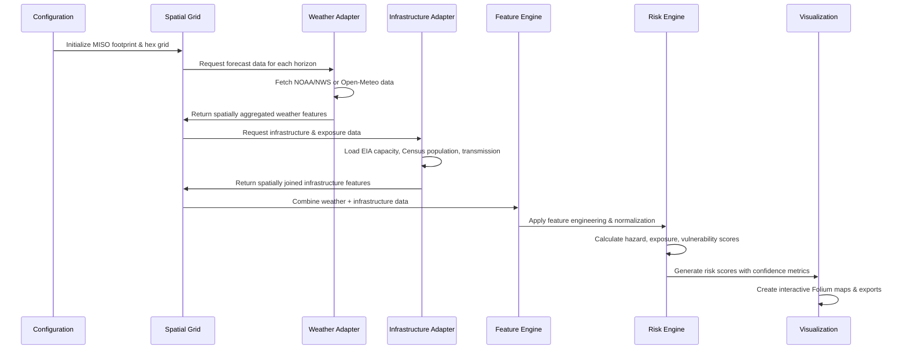

# Design Document

## Overview

The MISO Weather-Stress Heatmap MVP is designed as a single, comprehensive Jupyter notebook that transforms weather forecast data and infrastructure information into actionable grid stress visualizations. The system follows a modular, pipeline-based architecture that ingests data from multiple sources, processes it through standardized feature engineering, applies transparent risk scoring algorithms, and outputs interactive visualizations with confidence metrics.

The design prioritizes transparency, reproducibility, and extensibility while maintaining fuel-agnostic and policy-neutral analysis. The system operates in two modes: "demo" mode using cached sample data for development and testing, and "live" mode that fetches real-time data from APIs.

## Architecture

### High-Level System Flow



### Core Components Architecture

The system is structured around five main components:

1. **Configuration Manager**: Handles runtime modes, coordinate systems, forecast horizons, and user-configurable weights
2. **Data Ingestion Layer**: Modular adapters for weather, infrastructure, and demographic data sources
3. **Spatial Processing Engine**: Geographic grid generation and spatial aggregation functions
4. **Risk Assessment Engine**: Feature engineering, scoring algorithms, and confidence calculations
5. **Visualization & Export Layer**: Interactive map generation and standardized output formats

### Data Flow Pipeline



## Components and Interfaces

### 1. Configuration Manager

**Purpose**: Centralized configuration handling and runtime mode management

**Key Functions**:
- `load_config()`: Loads YAML configuration with weights and thresholds
- `set_runtime_mode(mode)`: Switches between "demo" and "live" modes
- `validate_config()`: Ensures all required parameters are present

**Configuration Schema**:
```yaml
runtime:
  mode: "demo" | "live"
  horizons_h: [12, 24, 36, 48]
  crs: "EPSG:4326"
  random_seed: 42

weights:
  hazard:
    thermal: 0.3
    wind: 0.3
    precip: 0.25
    storm: 0.15
  exposure:
    pop: 0.7
    load: 0.3
  vulnerability:
    renew_share: 0.6
    tx_scarcity: 0.3
    outage: 0.1
  blend:
    alpha: 0.5  # hazard weight
    beta: 0.3   # exposure weight
    gamma: 0.2  # vulnerability weight

thresholds:
  thermal:
    heat_low: 85  # °F
    heat_high: 100
    cold_low: 10
    cold_high: 0
  wind:
    gust_low: 20  # mph
    gust_high: 50
    sustained_threshold: 30
  precip:
    rain_heavy: 10  # mm/h
    snow_heavy: 5   # cm/h
    ice_threshold: 0  # any ice = max score
```

### 2. Spatial Processing Engine

**Purpose**: Geographic grid management and spatial data operations

**Key Classes**:
- `MISOFootprint`: Manages MISO territory boundary definition
- `HexGridGenerator`: Creates uniform hexagonal analysis grid
- `SpatialAggregator`: Handles spatial joins and aggregations

**Core Functions**:
```python
def create_miso_footprint() -> gpd.GeoDataFrame:
    """Create MISO footprint from state boundaries + Manitoba portion"""
    
def generate_hex_grid(footprint: gpd.GeoDataFrame, hex_km: float = 40) -> gpd.GeoDataFrame:
    """Generate hexagonal grid clipped to MISO footprint"""
    
def spatial_aggregate_to_grid(data: gpd.GeoDataFrame, grid: gpd.GeoDataFrame, 
                             agg_method: str = "mean") -> pd.DataFrame:
    """Aggregate point/polygon data to grid cells"""
```

### 3. Weather Data Adapter

**Purpose**: Standardized weather forecast ingestion from multiple sources

**Interface Design**:
```python
class WeatherAdapter(ABC):
    @abstractmethod
    def fetch_forecast(self, horizon_h: int, grid: gpd.GeoDataFrame) -> pd.DataFrame:
        """Fetch and aggregate weather data for specified horizon"""
        
    @abstractmethod
    def get_available_parameters(self) -> List[str]:
        """Return list of available weather parameters"""

class NOAAAdapter(WeatherAdapter):
    """Primary adapter for NOAA/NWS gridpoint forecast API"""
    
class OpenMeteoAdapter(WeatherAdapter):
    """Fallback adapter for Open-Meteo API"""
```

**Standardized Output Schema**:
```python
weather_columns = [
    'cell_id', 'horizon_h', 'timestamp', 'temp_2m', 'heat_index', 
    'wind_speed', 'wind_gust', 'precip_rate', 'snow_rate', 
    'dewpoint', 'relative_humidity', 'storm_probability'
]
```

### 4. Infrastructure Data Adapter

**Purpose**: Load and process infrastructure, capacity, and demographic data

**Key Components**:
- `CapacityProcessor`: Handles EIA-860/923 generation capacity data
- `PopulationProcessor`: Processes Census population density data
- `TransmissionProcessor`: Manages transmission line density calculations

**Core Functions**:
```python
def load_generation_capacity() -> gpd.GeoDataFrame:
    """Load EIA capacity data with fuel type breakdown"""
    
def calculate_renewable_share(capacity_data: gpd.GeoDataFrame, 
                             grid: gpd.GeoDataFrame) -> pd.DataFrame:
    """Calculate renewable percentage within 50km of each cell"""
    
def process_population_density() -> gpd.GeoDataFrame:
    """Load and process Census population density data"""
    
def estimate_transmission_density(grid: gpd.GeoDataFrame) -> pd.DataFrame:
    """Calculate transmission line density or use baseline values"""
```

### 5. Feature Engineering Engine

**Purpose**: Transform raw data into normalized risk factors

**Feature Categories**:
- **Thermal Stress**: Heat index and cold temperature impacts
- **Wind Stress**: Wind gust and sustained wind impacts  
- **Precipitation Stress**: Rain, snow, and ice accumulation impacts
- **Storm Proxy**: Combined precipitation and wind conditions
- **Exposure Metrics**: Population density and load factors
- **Vulnerability Metrics**: Renewable share and transmission scarcity

**Normalization Strategy**:
```python
def normalize_thermal_stress(temp_2m: float, heat_index: float) -> float:
    """
    Heat: 0 at HI≤85°F, 1 at HI≥100°F, linear interpolation
    Cold: 0 at T≥10°F, 1 at T≤0°F, linear interpolation
    Return: max(heat_score, cold_score)
    """
    
def normalize_wind_stress(wind_speed: float, wind_gust: float) -> float:
    """
    Base: 0 at gust≤20mph, 1 at gust≥50mph, linear interpolation
    Bonus: +0.2 if sustained wind≥30mph
    """
    
def normalize_precip_stress(rain_rate: float, snow_rate: float, ice_rate: float) -> float:
    """
    Rain: 0 at 0mm/h, 1 at ≥10mm/h
    Snow: 0 at 0cm/h, 1 at ≥5cm/h  
    Ice: 1.0 if any ice accumulation detected
    """
```

### 6. Risk Scoring Engine

**Purpose**: Combine normalized features into final risk scores with confidence metrics

**Risk Formula Implementation**:
```python
def calculate_risk_score(hazard: float, exposure: float, vulnerability: float,
                        weights: dict) -> Tuple[float, float]:
    """
    Risk = zscore(α*H + β*E + γ*V)
    Confidence = f(data_coverage, forecast_horizon)
    """
    
def calculate_confidence(data_coverage: float, horizon_h: int, 
                        base_confidence: float = 0.9) -> float:
    """
    Confidence decreases with:
    - Lower data coverage
    - Longer forecast horizons
    - Missing infrastructure data
    """
```

### 7. Visualization Engine

**Purpose**: Generate interactive maps and summary visualizations

**Core Components**:
- `FoliumMapGenerator`: Creates layered interactive maps
- `PlotlyDashboard`: Generates summary charts and ablation analysis
- `ExportManager`: Handles standardized output generation

**Map Features**:
- Layer control for different forecast horizons
- Choropleth visualization with risk-based color scaling
- Interactive tooltips with risk breakdown
- Confidence indicators and data quality metrics

## Data Models

### Core Data Structures

**Grid Cell Model**:
```python
@dataclass
class GridCell:
    cell_id: str
    geometry: Polygon
    centroid_lat: float
    centroid_lon: float
    area_km2: float
```

**Weather Feature Model**:
```python
@dataclass
class WeatherFeatures:
    cell_id: str
    horizon_h: int
    timestamp: datetime
    thermal_stress: float  # [0,1]
    wind_stress: float     # [0,1]
    precip_stress: float   # [0,1]
    storm_proxy: float     # [0,1]
    confidence: float      # [0,1]
```

**Infrastructure Feature Model**:
```python
@dataclass
class InfrastructureFeatures:
    cell_id: str
    population_density: float      # normalized [0,1]
    renewable_share: float         # [0,1]
    transmission_density: float    # normalized [0,1]
    load_factor: Optional[float]   # normalized [0,1] if available
    outage_flag: bool
```

**Risk Assessment Model**:
```python
@dataclass
class RiskAssessment:
    cell_id: str
    horizon_h: int
    hazard_score: float        # [0,1]
    exposure_score: float      # [0,1]
    vulnerability_score: float # [0,1]
    final_risk: float          # z-scored
    confidence: float          # [0,1]
    top_contributors: List[str] # top 3 risk factors
```

## Error Handling

### Data Quality Management

**Missing Data Strategy**:
- Weather data: Graceful degradation to demo mode if API failures exceed threshold
- Infrastructure data: Use baseline values with clear documentation of limitations
- Population data: Interpolate from available Census data or use regional averages

**API Failure Handling**:
```python
def robust_weather_fetch(primary_adapter: WeatherAdapter, 
                        fallback_adapter: WeatherAdapter,
                        max_retries: int = 3) -> pd.DataFrame:
    """
    1. Try primary adapter (NOAA/NWS)
    2. On failure, try fallback adapter (Open-Meteo)
    3. On complete failure, load cached demo data
    4. Log all failures and data source switches
    """
```

**Validation Framework**:
- Data completeness checks (minimum coverage thresholds)
- Spatial consistency validation (grid alignment)
- Temporal consistency validation (forecast horizon alignment)
- Value range validation (normalized features in [0,1])

### System Resilience

**Graceful Degradation**:
- Automatic fallback to demo mode on data unavailability
- Partial analysis with reduced confidence when some data sources fail
- Clear user notifications about data limitations and their impact on results

**Logging and Monitoring**:
- Comprehensive logging of all data sources, API calls, and processing steps
- Performance monitoring for large spatial operations
- Data freshness tracking and staleness warnings

## Testing Strategy

### Unit Testing Framework

**Core Component Tests**:
- Spatial processing accuracy (grid generation, spatial joins)
- Feature engineering correctness (normalization functions)
- Risk scoring mathematical accuracy
- Configuration validation and error handling

**Data Adapter Tests**:
- Mock API responses for weather adapters
- Sample data processing for infrastructure adapters
- Error handling for network failures and malformed data

### Integration Testing

**End-to-End Pipeline Tests**:
- Complete workflow execution with sample data
- Output format validation (HTML, PNG, CSV)
- Performance benchmarking with realistic data volumes

**Spatial Accuracy Tests**:
- Verify grid cell coverage of MISO footprint
- Validate spatial aggregation accuracy
- Test coordinate system transformations

### Validation Testing

**Scientific Validation**:
- Spot-check high wind areas align with elevated wind stress scores
- Verify urban centers show appropriate exposure scores
- Validate that risk scores respond logically to extreme weather scenarios

**Ablation Analysis**:
- Systematic testing of risk score sensitivity to individual components
- Validation that removing hazard/exposure/vulnerability components produces expected changes
- Confidence metric accuracy under various data availability scenarios

### Performance Testing

**Scalability Tests**:
- Processing time for full MISO grid (~1000-2000 hex cells)
- Memory usage optimization for large spatial datasets
- API rate limiting and batch processing efficiency

**Output Quality Tests**:
- Interactive map responsiveness with full dataset
- Export file size and format validation
- Cross-browser compatibility for HTML outputs